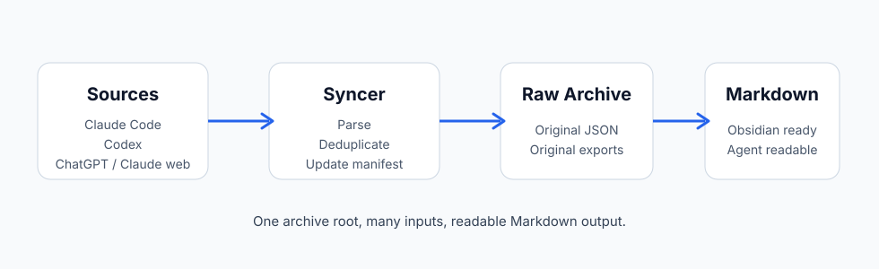
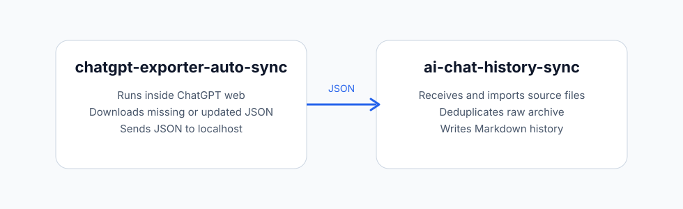
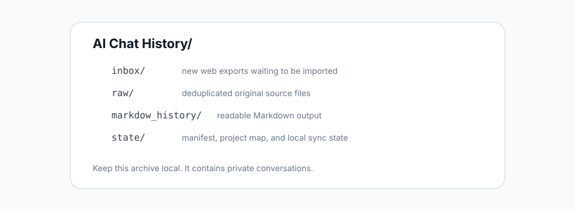
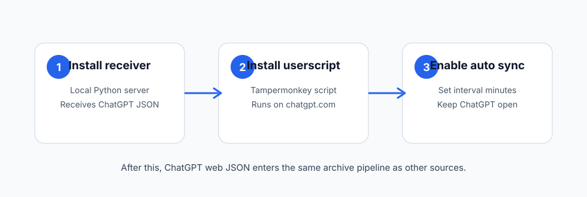

# AI Chat History Sync

Collect AI chat histories from local tools and browser exports into one local,
Obsidian-friendly Markdown archive.

This repository is the organizer. It watches local AI chat sources, keeps raw
source files, deduplicates records, and writes readable Markdown for humans and
local agents.



## What This Repository Is For

Use this project when you want one local folder that contains your AI chat
history from multiple places.

It is good for:

- browsing AI chat history in Obsidian or any Markdown editor;
- giving local agents a searchable, file-based memory archive;
- keeping raw source files and generated Markdown side by side;
- collecting local Claude Code and Codex sessions;
- importing ChatGPT web and Claude web exports;
- installing the companion ChatGPT auto-sync userscript as a submodule.

It is not:

- a cloud sync service;
- a replacement for each AI product's official account history;
- a Claude web auto-sync implementation.

## Two Repositories, Two Jobs

| Repository | Job |
| --- | --- |
| [`chatgpt-exporter-auto-sync`](https://github.com/mubaiblake/chatgpt-exporter-auto-sync) | Pull ChatGPT web JSON from the browser and send it to localhost. |
| `ai-chat-history-sync` | Collect local logs and web JSON exports, then build raw archives and Markdown. |



## Supported Sources

| Source | Input | Output |
| --- | --- | --- |
| Claude Code | Local sessions from `~/.claude/projects` | Markdown |
| Codex local | Local sessions from `~/.codex/sessions` | Markdown |
| ChatGPT web | JSON / JSONL exports or auto-sync receiver input | Raw JSON plus Markdown |
| Claude web | Markdown / JSON / JSONL / TXT exports | Raw source plus Markdown |

ChatGPT web full-auto sync is handled through the companion submodule:

```text
vendor/chatgpt-exporter-auto-sync
```

## Folder Layout

Choose one archive root. The default example is:

```text
~/AI Chat History
```

The syncer manages this structure inside it:

```text
AI Chat History/
  inbox/
    chatgpt-web/
    claude-web/
  raw/
    chatgpt-web/
    claude-web/
  markdow_history/
    claude-code/
    codex-local/
    chatgpt-web/
    claude-web/
  state/
    manifest.json
    project_map.json
```



The `markdow_history` spelling is preserved for compatibility with the current
pipeline.

## Quick Start

### 1. Clone

```bash
git clone --recurse-submodules https://github.com/mubaiblake/ai-chat-history-sync.git
cd ai-chat-history-sync
```

If you cloned without submodules:

```bash
git submodule update --init --recursive
```

### 2. Create Your Archive Folder

```bash
python3 ai_chat_history/sync_ai_chats.py init --archive-root "$HOME/AI Chat History"
```

### 3. Run One Sync

```bash
python3 ai_chat_history/sync_ai_chats.py sync \
  --archive-root "$HOME/AI Chat History"
```

### 4. Run Continuously

```bash
python3 ai_chat_history/sync_ai_chats.py watch \
  --archive-root "$HOME/AI Chat History" \
  --interval 60
```

On macOS, install the watcher as a LaunchAgent:

```bash
python3 ai_chat_history/install_watcher_launchagent.py \
  --archive-root "$HOME/AI Chat History"
```

## ChatGPT Web Auto-Sync

For a simple ChatGPT web setup:

1. Install the receiver.
2. Install the companion userscript.
3. Enable `Auto sync JSON to local` in ChatGPT.

```bash
python3 ai_chat_history/install_receiver_launchagent.py \
  --archive-root "$HOME/AI Chat History"
```

Then install the userscript from:

```text
vendor/chatgpt-exporter-auto-sync/dist/chatgpt.user.js
```

After the companion repository is published, you can also install it from:

```text
https://raw.githubusercontent.com/mubaiblake/chatgpt-exporter-auto-sync/master/dist/chatgpt.user.js
```



Daily use:

1. Keep the receiver running.
2. Open `https://chatgpt.com`.
3. Enable `Auto sync JSON to local`.
4. Keep the ChatGPT tab open.

The receiver writes incoming ChatGPT JSON into this archive root, then the sync
pipeline imports it into raw JSON plus Markdown.

## Manual Web Export Import

You can also drop supported ChatGPT or Claude web export files into the project
folder or the matching inbox folder, then run:

```bash
python3 ai_chat_history/sync_ai_chats.py sync \
  --archive-root "$HOME/AI Chat History"
```

The importer moves supported web exports into the correct inbox, deduplicates
them, and writes Markdown output.

## Project Folder Names

Web project names are configured in:

```text
AI Chat History/state/project_map.json
```

The syncer auto-adds missing project IDs. You can edit `name` and `dir` to choose
human-readable folders.

## Privacy

Do not commit these folders:

```text
inbox/
raw/
markdow_history/
state/
```

They contain your private chat history, logs, and local sync state. The included
`.gitignore` excludes them by default.

## Tests

```bash
python3 -m unittest ai_chat_history.tests.test_sync_ai_chats -v
python3 -m py_compile ai_chat_history/sync_ai_chats.py ai_chat_history/install_receiver_launchagent.py
```

## Notes

- This project is local-first and file-based.
- ChatGPT web auto-sync depends on the companion userscript and unofficial
  ChatGPT web endpoints.
- Claude web auto-sync is not included yet. Claude web exports can still be
  imported manually.
